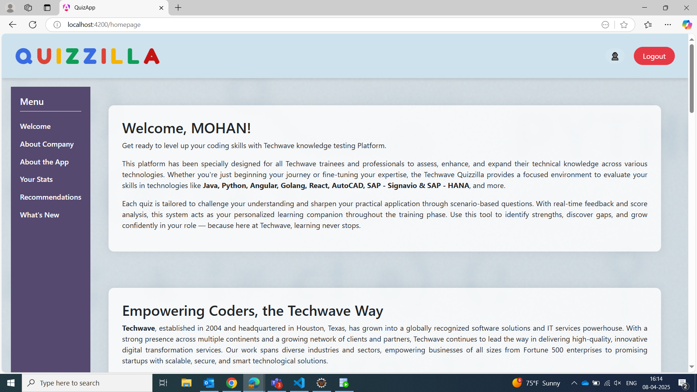
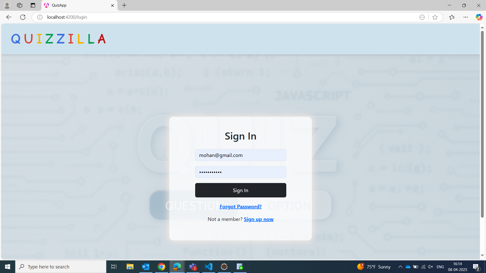
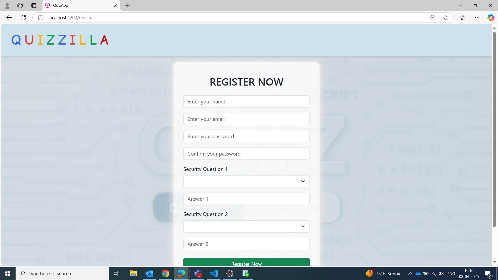
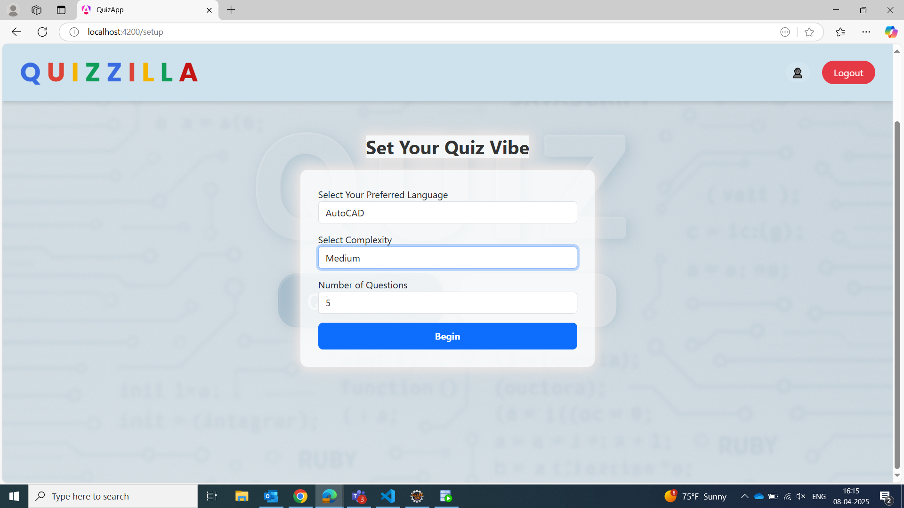
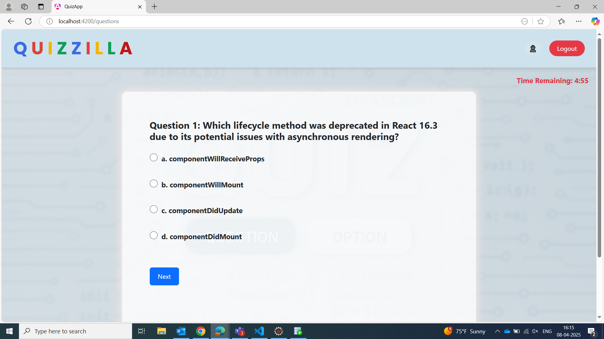
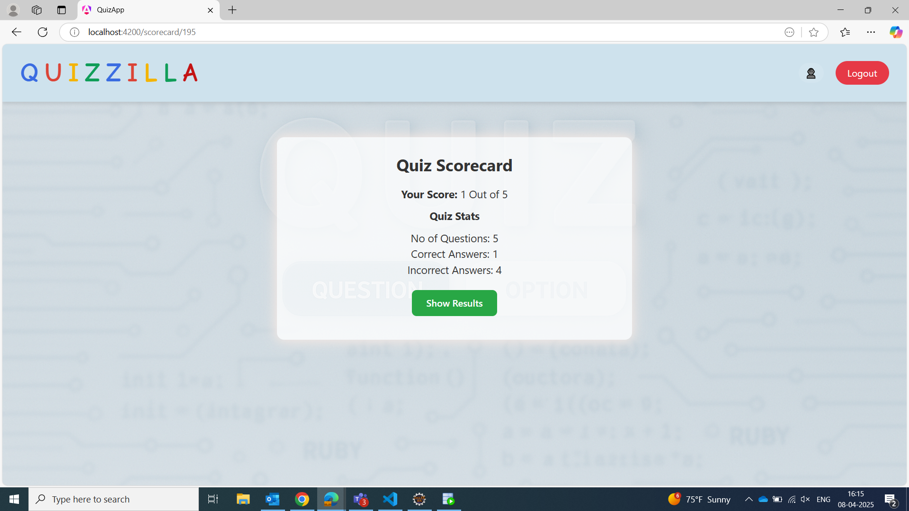
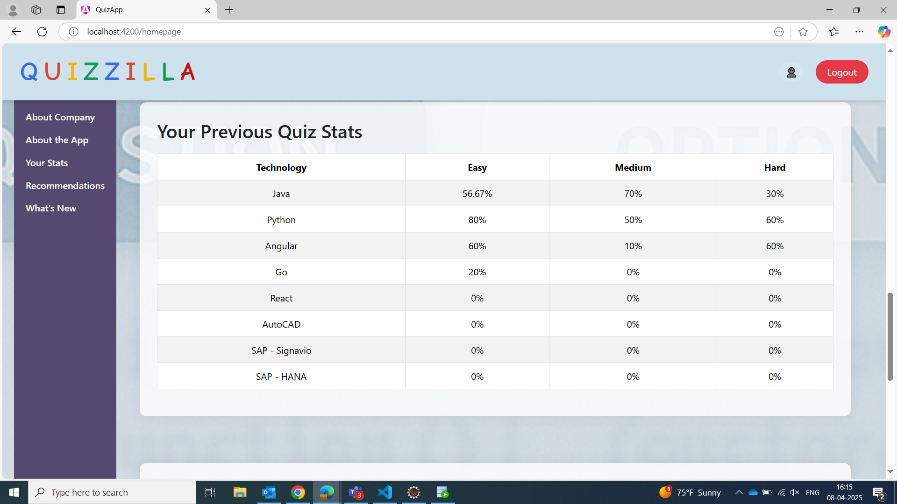
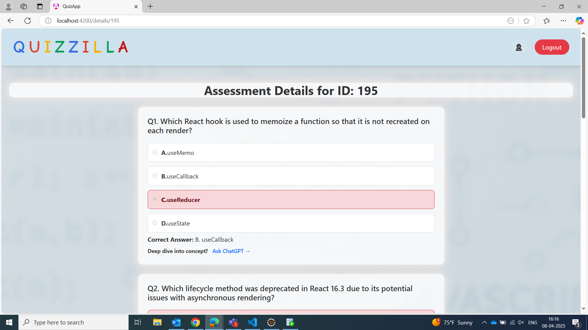

# 🧠 OnlineTestSystem (QUIZZILLA Clone)

Welcome to **OnlineTestSystem**, a web-based skill assessment platform built using **Spring Boot**, **Angular**, and **Microservices architecture**. Originally inspired by **QUIZZILLA**, this application allows organizations to evaluate the technical proficiency of their employees and users across various technologies.

## 🚀 Overview

This platform enables:
- Employees to take timed quizzes on technologies like Java, Python, Angular, etc.
- Admins to view quiz statistics and manage test data.
- Immediate feedback on test results with detailed review.

### 🔍 Features
- User Registration & Authentication (with security questions for recovery)
- Role-based dashboards (Admin vs Employee)
- Quiz customization by topic, difficulty, and number of questions
- Score tracking and performance review
- RESTful API communication between front-end and back-end
- JWT and OAuth2 authentication for secure access

## 🧱 Tech Stack

**Frontend:** Angular  
**Backend:** Spring Boot (Java)  
**Authentication:** JWT, OAuth2  
**Database:** MySQL  
**Build Tools:** Maven  
**Deployment:** AWS (EC2, S3), Docker (optional)  
**DevOps:** Jenkins, GitHub Actions (for CI/CD)

## 📂 Project Structure

OnlineTestSystem/ ├── backend/ # Spring Boot API services ├── frontend(Branch)/ # Angular-based UI └── database/ # SQL scripts for schema and initial data

## 🛠 Setup Instructions

### Backend
1. Navigate to `/backend`
2. Run `mvn clean install`
## 3. Launch with your IDE(preferably Eclipse) or `mvn spring-boot:run`, will have to run each service as a Java application starting with Discovery Server to replicate all the servers.

### Frontend
1. Navigate to `/frontend`
2. Run `npm install`
3. Start with `ng serve` (runs on `http://localhost:4200`)

### Database
1. Setup MySQL, Oracle SQL and run the schema from `/database/schema.sql`

## 📈 Pages & Flow

- **Registration:** Create an account with email and security questions
- **Login:** Role-based access (Admin/Employee)
- **Homepage:** Welcome message and quiz overview
- **Quiz Setup:** Select tech stack, difficulty, and question count
- **Question View:** One question at a time with countdown timer
- **Scorecard:** Immediate results summary
- **Review Page:** View correct vs. incorrect answers with explanations

## 📊 Example Roles

**Admin:**  
- View all user scores and histories  
- Analyze performance across technologies  

**Employee:**  
- Take quizzes  
- Review stats and improve skills  

## 💡 Future Enhancements

- Add AI-based question generation  
- Advanced analytics dashboard for admins  
- Integration with learning resources for skill improvement  

---

Feel free to explore, fork, and contribute to the project. Let's learn and grow together!

## 📄 **Note:** A file named **"Questions for DB"** has been added to help populate the database with sample quiz questions for testing and demonstration purposes.

## 🧪 Testing
Unit Testing: JUnit, Mockito
Integration Tests for API endpoints
Postman Collection included for manual API testing

## ☁️ Deployment (Optional)
Backend deployed on AWS EC2 and RDS
Dynamic front-end hosted via AWS S3 + CloudFront
Jenkins pipelines for CI/CD

## 📸 Screenshots

Here are a few screenshots showcasing key parts of the **OnlineTestSystem** platform:

### 🏠 Homepage

### 🔐 Login Page

### 📝 Register Page

### ⚙️ Quiz Setup

### ❓ Quiz in Progress

### 🧮 Scorecard

### 📊 Stats Page

### 🔍 Quiz Review Details

